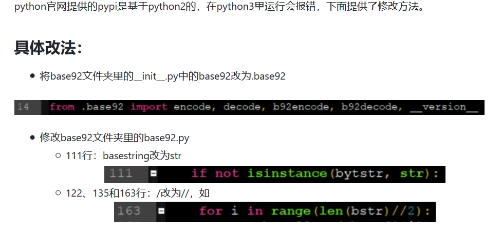

### CTF中的常用的base系列解码脚本

- 说明：本脚本改编自[可以用在CTF中的base系列解码程序](https://segmentfault.com/a/1190000021454534) 

- 目前可以解码的范围是：base64,base16,base32,base36,base58,base62,base85,base91,base92 and base128
- 运行环境：python 3.6
- 相关库安装

```
pip3 install base58
pip3 install base91
pip3 install base92
pip3 install pybase62
其余模块安装参考：https://www.cnblogs.com/pcat/p/11625834.html
```

- 关于base92模块在python3中会出错的问题



